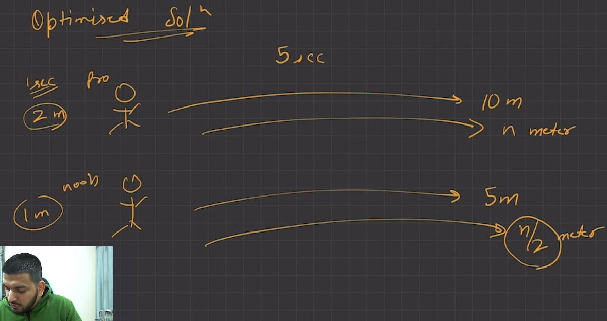
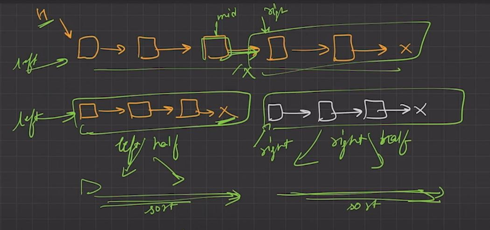

# **Linked List**

* [Segregate even and odd nodes in a Linked List](https://www.geeksforgeeks.org/segregate-even-and-odd-elements-in-a-linked-list/ "GFG")

&nbsp;
* [Reverse a Linked List](https://www.geeksforgeeks.org/reverse-a-linked-list/ "GFG")

&nbsp;
* [Reverse Linked in K Groups](https://www.geeksforgeeks.org/reverse-a-list-in-groups-of-given-size/ "GFG")
  

&nbsp;

* [Floyd Cycle](https://www.geeksforgeeks.org/floyds-cycle-finding-algorithm/ "GFG")
    

&nbsp;

* [Remove duplicate in Sorted Linked List](https://www.geeksforgeeks.org/remove-duplicates-from-a-sorted-linked-list/ "GFG")

* [Remove duplicate in Unsorted Linked List](https://www.geeksforgeeks.org/remove-duplicates-from-an-unsorted-linked-list/ "GFG")
  
* [Intersection of Two sorted Linked List](https://www.geeksforgeeks.org/intersection-of-two-sorted-linked-lists/ "GFG")

&nbsp;
* [Merge Sort](https://www.geeksforgeeks.org/merge-sort-for-linked-list/ "GFG")
  

&nbsp;
* [Flatten a Linked List](https://www.geeksforgeeks.org/flattening-a-linked-list/ "GFG")

* [Delete nodes which have a greater value on right side](https://www.geeksforgeeks.org/delete-nodes-which-have-a-greater-value-on-right-side/ "GFG")
  

* [Count Triplet in Sorted Doubly Linked List](https://www.geeksforgeeks.org/count-triplets-sorted-doubly-linked-list-whose-sum-equal-given-value-x/ "GFG")

* [Add 1 to number represented by Linked List](https://www.geeksforgeeks.org/add-1-number-represented-linked-list/ "GFG")

