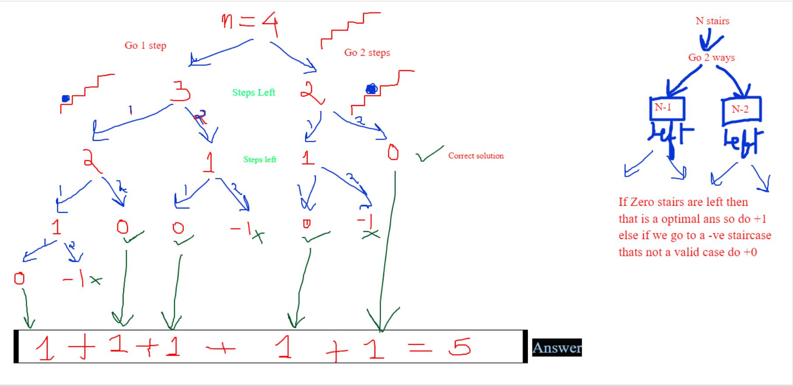
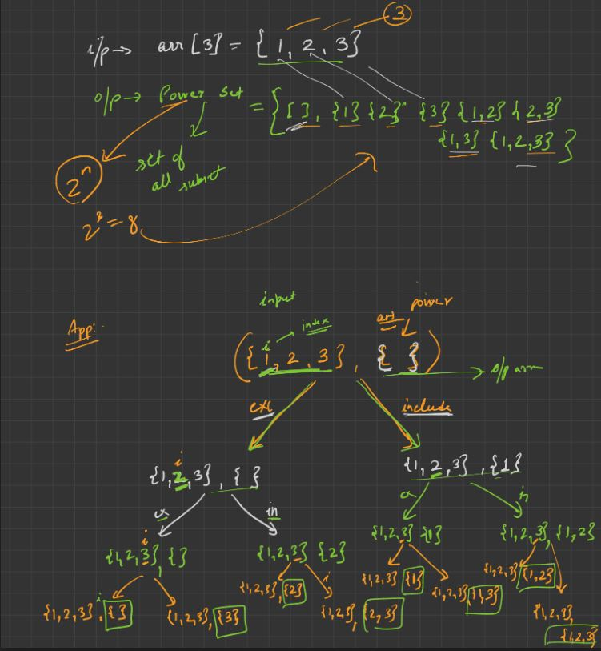

# **Recursion**

* [Aggressive Cows](https://takeuforward.org/data-structure/aggressive-cows-detailed-solution/ "TUF")

* [Binary Search](https://www.geeksforgeeks.org/binary-search/ "GFG")

* [Book allocation](https://www.geeksforgeeks.org/allocate-minimum-number-pages/ "GFG")

* [Bubble Sort](https://www.geeksforgeeks.org/bubble-sort/ "GFG")

* [Cooking Ninja](https://www.codingninjas.com/codestudio/problems/cooking-ninjas_1164174 "Coding Ninjas")

* [Insertion Sort](https://www.geeksforgeeks.org/insertion-sort/ "GFG")
* [Merge sort](https://www.geeksforgeeks.org/merge-sort/ "GFG")

* [Quick Sort](https://www.geeksforgeeks.org/quick-sort/ "GFG")
* [Selection Sort](https://www.geeksforgeeks.org/selection-sort/ "GFG")

* [Mirko Tree cutting Problem](https://www.spoj.com/problems/EKO/ "SPOJ")
  
&nbsp;
* [Count Nth step](https://www.geeksforgeeks.org/count-ways-reach-nth-stair-using-step-1-2-3/ "GFG")

&nbsp;

* [Fast Exponentiation](https://www.geeksforgeeks.org/exponential-squaring-fast-modulo-multiplication/ "GFG")

#### Example

#### Algorithm

&nbsp;
* [Permutation of a string](https://www.geeksforgeeks.org/write-a-c-program-to-print-all-permutations-of-a-given-string/ "GFG")

* [Permutation of a string Question](https://leetcode.com/problems/permutations/ "LC")

* [Letter Combinations of a Phone Number](https://www.geeksforgeeks.org/find-possible-words-phone-digits/ "GFG")

&nbsp;
* [Power Set](https://www.geeksforgeeks.org/recursive-program-to-generate-power-set/ "GFG")

&nbsp;
* [Rat Maze](https://practice.geeksforgeeks.org/problems/rat-in-a-maze-problem/1# "GFG")

* [Generate Parentheses](https://leetcode.com/problems/generate-parentheses/ "Leetcode")

